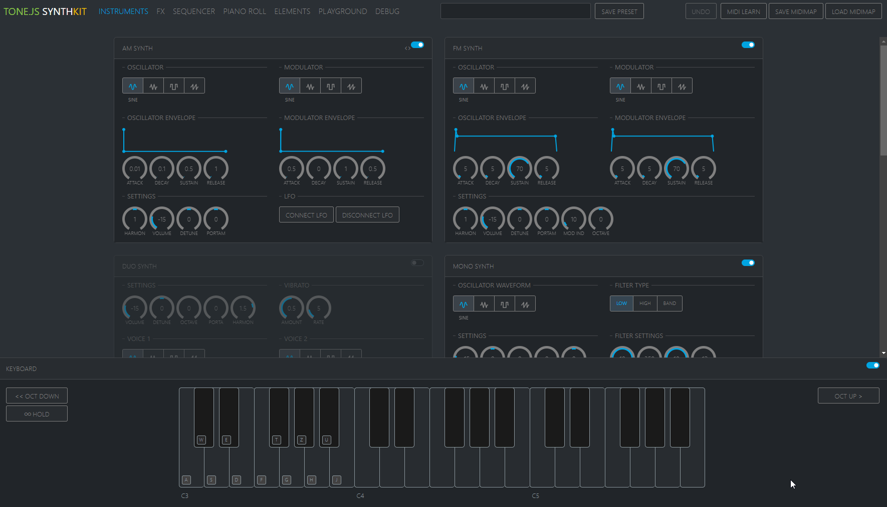
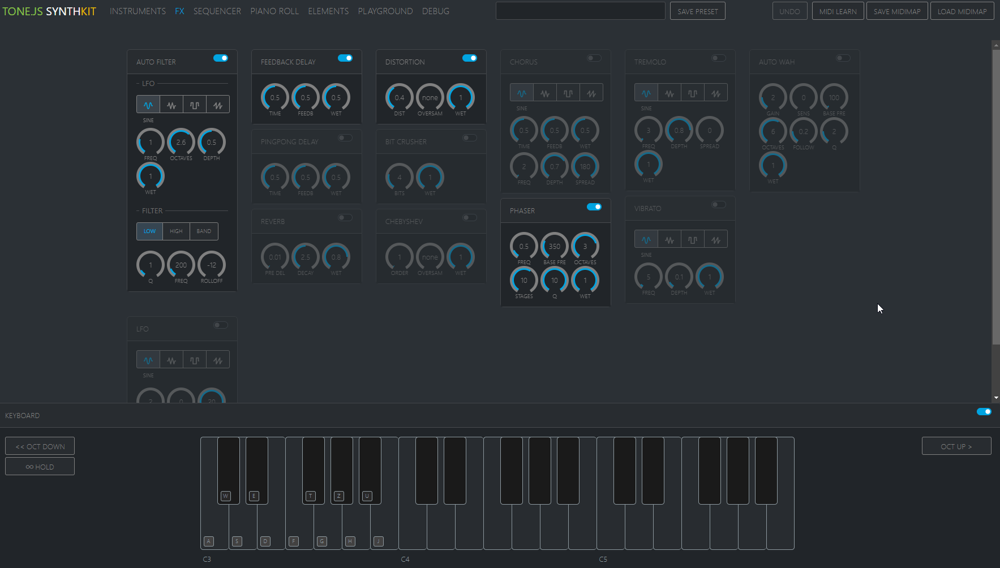
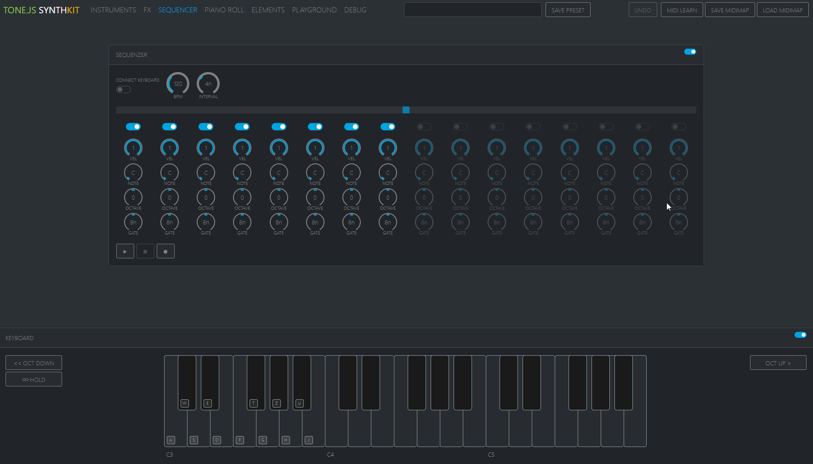
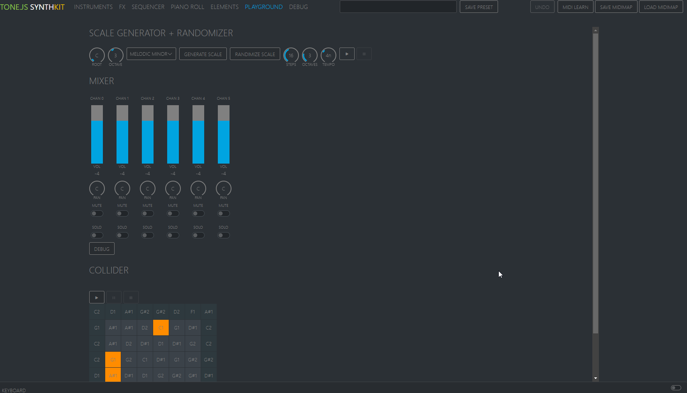

# Tone.js Synth KIT

Proof Of Concept of a web-based synthesizer standing on the shoulders of [angular](https://angular.dev/) and [tone.js](https://tonejs.github.io/).  
Mostly a personal playground. Contains interfaces for all current [tone.js](https://tonejs.github.io/) instruments and effects.  
Has Midi Support as well as preset saving and loading, on screen keyboard, step sequencer, piano roll and some experimental scale generators and colliders.  
#### Currently in alpha state.

  
  
  
  

## Installation

run `git clone https://github.com/michael-graute/synth-ui-components.git`  
run `cd synth-ui-components`  
run `yarn install`

## Development server

Run `ng serve` for a dev server. Navigate to `http://localhost:4200/`. The application will automatically reload if you change any of the source files.
